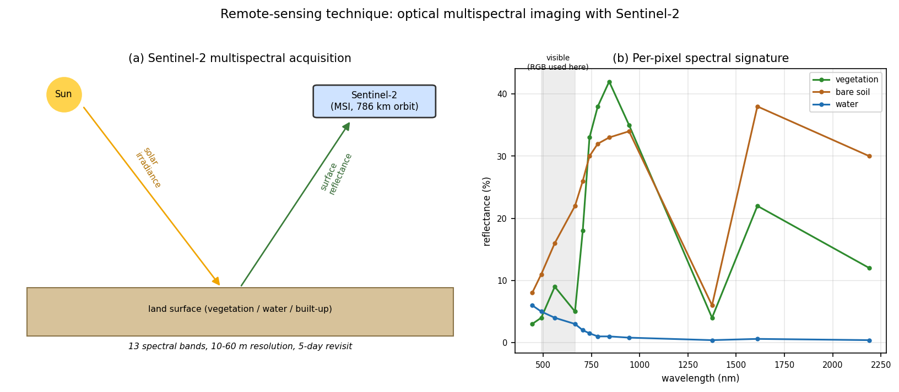
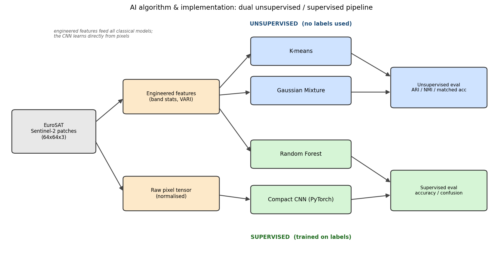

# AI4EO — Land-Cover Classification of Sentinel-2 Imagery (EuroSAT)

> An *AI for Earth Observation* project: classifying Sentinel-2
> satellite image patches into 10 land-use / land-cover classes using both
> **unsupervised** (K-means, Gaussian Mixture Models) and **supervised**
> (Random Forest, a compact CNN) machine learning — and quantifying the
> **environmental cost** of doing so.

<p align="center">
  
</p>
<p align="center">
  
</p>

---

## 1. The problem (what & why)

Accurate, up-to-date **land-use / land-cover (LULC)** maps underpin agriculture
monitoring, urban-growth tracking, deforestation alerts, flood-risk assessment
and climate reporting. Producing them by hand from satellite imagery is far too
slow, so the task is automated with machine learning.

This project tackles **patch-level LULC classification**: given a small
Sentinel-2 image tile, predict which of 10 land-cover classes it shows. We use
the public **EuroSAT** benchmark (Helber et al., 2019): 27,000 georeferenced
64×64-pixel patches drawn from Sentinel-2 scenes over Europe.

| | |
|---|---|
| **Classes (10)** | AnnualCrop, Forest, HerbaceousVegetation, Highway, Industrial, Pasture, PermanentCrop, Residential, River, SeaLake |
| **Sensor** | Sentinel-2 MSI (multispectral; this repo uses the RGB product = bands B04/B03/B02) |
| **Patch size** | 64 × 64 px (10 m ground resolution) |

A full discussion is in [`docs/PROBLEM_DESCRIPTION.md`](docs/PROBLEM_DESCRIPTION.md).

## 2. The remote-sensing technique & the AI algorithm

* **Remote sensing** — Sentinel-2 carries a passive **optical multispectral
  imager** measuring reflected sunlight in 13 bands. Different surfaces have
  different *spectral signatures*, which is what makes them separable. See
  figure `figures/01_sentinel2_technique.png` and
  [`docs/METHODS.md`](docs/METHODS.md).
* **AI algorithm** — a **dual pipeline** (figure
  `figures/02_pipeline_algorithm.png`):
  * *Unsupervised* — **K-means** and a **Gaussian Mixture Model** cluster the
    patches with no access to labels; we then measure how well the clusters
    align with the true classes (ARI, NMI, matched accuracy).
  * *Supervised* — a **Random Forest** on engineered spectral features and a
    **compact CNN** (PyTorch) trained directly on the raw pixels.

## 3. Project layout

```
ai4eo-eurosat-landcover/
├── README.md                  ← you are here
├── requirements.txt
├── LICENSE                    (MIT)
├── notebooks/
│   └── AI4EO_LandCover_Classification.ipynb   ← run this end-to-end
├── src/                       ← documented, importable Python package
│   ├── data.py                download / load EuroSAT (+ synthetic fallback)
│   ├── features.py            spectral feature engineering + PCA
│   ├── unsupervised.py        K-means, GMM
│   ├── supervised.py          Random Forest + compact CNN
│   ├── evaluate.py            metrics, cluster matching, plots
│   ├── carbon.py              energy / CO2 estimation
│   └── figures.py             technique + algorithm schematics
├── scripts/
│   ├── download_data.py       fetch the dataset
│   └── run_pipeline.py        headless end-to-end run -> results/ + figures/
├── docs/
│   ├── PROBLEM_DESCRIPTION.md
│   ├── METHODS.md
│   ├── ENVIRONMENTAL_COST.md
│   └── VIDEO_SCRIPT.md        narration script for the screencast
├── report/REPORT.md           consolidated write-up
├── figures/                   generated figures
└── results/                   metrics.json + logs
```

## 4. Quick start

```bash
# 1. install dependencies (Python 3.10+)
pip install -r requirements.txt

# 2. (optional) pre-download the data; the notebook/pipeline also auto-download
python scripts/download_data.py

# 3a. run everything headless (writes results/ and figures/)
python scripts/run_pipeline.py --n-per-class 500 --epochs 20

# 3b. or open the guided notebook
jupyter lab notebooks/AI4EO_LandCover_Classification.ipynb
```

No internet or no GPU? `python scripts/run_pipeline.py --synthetic` runs the
identical pipeline on a built-in synthetic Sentinel-2-like dataset.

## 5. Results (snapshot)

Measured on a CPU run with 500 patches/class (5,000 images; 3,000/750/1,250
train/val/test; CNN 25 epochs, seed 42). See [`report/REPORT.md`](report/REPORT.md)
and `results/metrics.json` for the full breakdown:

| Method | Type | Metric | Score |
|---|---|---|---|
| Random guess | — | accuracy | 0.10 |
| K-means | unsupervised | matched accuracy | 0.35 |
| Gaussian Mixture | unsupervised | matched accuracy | 0.39 |
| Random Forest | supervised (features) | accuracy | 0.72 |
| Compact CNN | supervised (pixels) | accuracy | **0.80** |

The CNN substantially outperforms the feature-based methods, illustrating why
deep learning dominates modern EO classification — at a measurable energy cost
(Section 6).

## 6. Environmental cost

Every run estimates its own energy use and CO₂ emissions from wall-clock time,
CPU power draw, facility overhead (PUE) and grid carbon intensity. The figures
and methodology are in [`docs/ENVIRONMENTAL_COST.md`](docs/ENVIRONMENTAL_COST.md)
and saved to `results/metrics.json`. A full CPU run here emits on the order of
**one gram of CO₂** — comparable to driving a petrol car a few metres.

## 7. Reproducibility

All randomness is seeded (`--seed`, default 42). The exact environment is
pinned in `requirements.txt`. `scripts/run_pipeline.py` regenerates every figure
and metric deterministically.

## 8. Citation / acknowledgements

* Helber, P., Bischke, B., Dengel, A., & Borth, D. (2019). *EuroSAT: A novel
  dataset and deep learning benchmark for land use and land cover
  classification.* IEEE JSTARS, 12(7), 2217–2226.
* Sentinel-2 imagery is provided free and open by the Copernicus programme
  (European Space Agency / European Commission).

Released under the MIT License.
